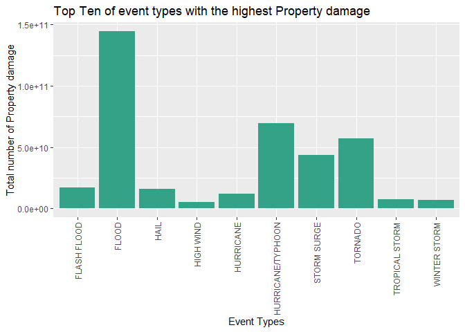

## Introduction

  Storms and other severe weather events can cause both public health and economic problems for communities and municipalities. Many severe events can result in fatalities, injuries, and property damage, and preventing such outcomes to the extent possible is a key concern.

This project involves exploring the U.S. National Oceanic and Atmospheric Administration's (NOAA) storm database. This database tracks characteristics of major storms and weather events in the United States, including when and where they occur, as well as estimates of any fatalities, injuries, and property damage.


## Synopsis

  The goal of the assignment is to explore the NOAA Storm Database and explore the effects of severe weather events on both population and economy.The database covers the time period between 1950 and November 2011.

## Data Processing

Download the raw data file and extract the data 


```r
fileUrl <- "https://d396qusza40orc.cloudfront.net/repdata%2Fdata%2FStormData.csv.bz2"
download.file(fileUrl, destfile = paste0("F:/datasciencecoursera/Repro_Project2", '/repdata%2Fdata%2FStormData.csv.bz2'))
```

Loading the data and extract it into a dataframe and Subset the storm data according to damage on Health and Economy


```r
Storm_df <- read.csv("F:/datasciencecoursera/Repro_Project2/repdata%2Fdata%2FStormData.csv.bz2")

S_health_data <-subset(Storm_df, select=c(EVTYPE,FATALITIES,INJURIES))
S_economy_data <-subset(Storm_df, select=c(EVTYPE,CROPDMG,CROPDMGEXP,PROPDMG,PROPDMGEXP))
```

Loading ggplot2,ggpubr library


```r
library(ggplot2)
library(ggpubr)
```

## Data Cleaning

Checking the factorlevels of the PROPDMGEXP and CROPDMGEXP variables


```r
levels(factor(S_economy_data[,5]))
```

```
##  [1] ""  "-" "?" "+" "0" "1" "2" "3" "4" "5" "6" "7" "8" "B" "h" "H" "K" "m" "M"
```

```r
levels(factor(S_economy_data[,3]))
```

```
## [1] ""  "?" "0" "2" "B" "k" "K" "m" "M"
```

Cleaning the property damaged data


```r
S_economy_data$PROPDMGEXP[S_economy_data$PROPDMGEXP == ""] <- NA
S_economy_data$PROPDMGEXP <- gsub("1", "10", S_economy_data$PROPDMGEXP)
S_economy_data$PROPDMGEXP <- gsub("NA", "1", S_economy_data$PROPDMGEXP)
S_economy_data$PROPDMGEXP <- gsub("\\-", "1", S_economy_data$PROPDMGEXP)
S_economy_data$PROPDMGEXP <- gsub("\\?", "1", S_economy_data$PROPDMGEXP)
S_economy_data$PROPDMGEXP <- gsub("\\+", "1", S_economy_data$PROPDMGEXP)
S_economy_data$PROPDMGEXP <- gsub("^0$", "1", S_economy_data$PROPDMGEXP)
S_economy_data$PROPDMGEXP <- gsub("h|H", "100", S_economy_data$PROPDMGEXP)
S_economy_data$PROPDMGEXP <- gsub("K", "1000", S_economy_data$PROPDMGEXP)
S_economy_data$PROPDMGEXP <- gsub("m|M", "1000000", S_economy_data$PROPDMGEXP)
S_economy_data$PROPDMGEXP <- gsub("B", "1000000000", S_economy_data$PROPDMGEXP)
S_economy_data$PROPDMGEXP <- gsub("2", "100", S_economy_data$PROPDMGEXP)
S_economy_data$PROPDMGEXP <- gsub("3", "1000", S_economy_data$PROPDMGEXP)
S_economy_data$PROPDMGEXP <- gsub("4", "10000", S_economy_data$PROPDMGEXP)
S_economy_data$PROPDMGEXP <- gsub("5", "100000", S_economy_data$PROPDMGEXP)
S_economy_data$PROPDMGEXP <- gsub("6", "1000000", S_economy_data$PROPDMGEXP)
S_economy_data$PROPDMGEXP <- gsub("7", "10000000", S_economy_data$PROPDMGEXP)
S_economy_data$PROPDMGEXP <- gsub("8", "100000000", S_economy_data$PROPDMGEXP)
```

 Cleaning the crop damaged data
 

```r
S_economy_data$CROPDMGEXP[S_economy_data$CROPDMGEXP == ""] <- NA
S_economy_data$CROPDMGEXP <- gsub("NA", "1", S_economy_data$CROPDMGEXP)
S_economy_data$CROPDMGEXP <- gsub("\\?", "1", S_economy_data$CROPDMGEXP)
S_economy_data$CROPDMGEXP <- gsub("^0$", "1", S_economy_data$CROPDMGEXP)
S_economy_data$CROPDMGEXP <- gsub("k|K", "1000", S_economy_data$CROPDMGEXP)
S_economy_data$CROPDMGEXP <- gsub("m|M", "1000000", S_economy_data$CROPDMGEXP)
S_economy_data$CROPDMGEXP <- gsub("B", "1000000000", S_economy_data$CROPDMGEXP)
S_economy_data$CROPDMGEXP <- gsub("2", "100", S_economy_data$CROPDMGEXP)
```


## Results

### The impact on event types in Economy

##### Checking property damage by event types
 
Creating a dataset to summarize the property damage by event types.
Listing the top 10 with highest values.


```r
S_economy_data$TOTALPROP <- S_economy_data$PROPDMG * as.numeric(S_economy_data$PROPDMGEXP)
Storm_property <- aggregate(TOTALPROP ~ EVTYPE, data = S_economy_data, sum)
max_property <- Storm_property[order(-Storm_property$TOTALPROP), ]
max_property[1:10, ]
```

```
##                EVTYPE    TOTALPROP
## 63              FLOOD 144657709800
## 181 HURRICANE/TYPHOON  69305840000
## 335           TORNADO  56947380674
## 283       STORM SURGE  43323536000
## 51        FLASH FLOOD  16822673772
## 105              HAIL  15735267456
## 173         HURRICANE  11868319010
## 343    TROPICAL STORM   7703890550
## 402      WINTER STORM   6688497251
## 158         HIGH WIND   5270046295
```

Visualizing the Top Ten of event types with the highest Property damage


```r
ggplot(data = max_property[1:10, ],aes(x=TOTALPROP,y=EVTYPE))+
  geom_bar(stat="identity" ,fill = "#34A287") +
  ggpubr::rotate_x_text() +
  coord_flip() + xlab("Total number of Property damage") +  ylab("Event Types") +
  ggtitle("Top Ten of event types with the highest Property damage")
```

<!-- -->

##### Observation

The event type that produces the highest property damage in the U.S. is Flood
    
##### Checking crop damage by event types
    
Creating a dataset to summarize the crop damage by event types.
Ordering the results and selecting the top ten with the highest values


```r
S_economy_data$TOTALCROP <- S_economy_data$CROPDMG * as.numeric(S_economy_data$CROPDMGEXP)
Storm_crop <- aggregate(TOTALCROP ~ EVTYPE, data = S_economy_data, sum)
max_crop <- Storm_crop[order(-Storm_crop$TOTALCROP), ]
max_crop[1:10, ]
```

```
##               EVTYPE   TOTALCROP
## 16           DROUGHT 13972566000
## 35             FLOOD  5661968450
## 99       RIVER FLOOD  5029459000
## 86         ICE STORM  5022113500
## 53              HAIL  3025954470
## 78         HURRICANE  2741910000
## 83 HURRICANE/TYPHOON  2607872800
## 30       FLASH FLOOD  1421317100
## 26      EXTREME COLD  1292973000
## 47      FROST/FREEZE  1094086000
```

Visualizing the Top Ten of event types with the highest Crop damage


```r
ggplot(data = max_crop[1:10, ],aes(x=TOTALCROP,y=EVTYPE) )+
  geom_bar(stat="identity" ,fill = "#895178") +
  ggpubr::rotate_x_text() +
  coord_flip() + xlab("Total number of Crop damage") +  ylab("Event Types") +
  ggtitle("Top Ten of event types with the highest Crop damage")
```

<!-- -->

##### Observation

  The event type that produces the highest crop damage in the U.S. is Drought

### The effect of event types in Population Health

Creating a dataset to summarize the fatalities by event type. 
Select top 10 having the highest values from the ordered result.


```r
Storm_fatalities <- aggregate(FATALITIES ~ EVTYPE, data = S_health_data, sum)
max_fatalities <- Storm_fatalities[order(-Storm_fatalities$FATALITIES), ]
max_fatalities[1:10, ]
```

```
##             EVTYPE FATALITIES
## 834        TORNADO       5633
## 130 EXCESSIVE HEAT       1903
## 153    FLASH FLOOD        978
## 275           HEAT        937
## 464      LIGHTNING        816
## 856      TSTM WIND        504
## 170          FLOOD        470
## 585    RIP CURRENT        368
## 359      HIGH WIND        248
## 19       AVALANCHE        224
```

Creating a dataset to summarize the injuries by event type.
Select top 10 having the highest values from the ordered result.


```r
Storm_injuries <- aggregate(INJURIES ~ EVTYPE, data = Storm_df, sum)
max_injuries <- Storm_injuries[order(-Storm_injuries$INJURIES), ] 
max_injuries[1:10, ]
```

```
##                EVTYPE INJURIES
## 834           TORNADO    91346
## 856         TSTM WIND     6957
## 170             FLOOD     6789
## 130    EXCESSIVE HEAT     6525
## 464         LIGHTNING     5230
## 275              HEAT     2100
## 427         ICE STORM     1975
## 153       FLASH FLOOD     1777
## 760 THUNDERSTORM WIND     1488
## 244              HAIL     1361
```


Creating a dataset to summarize the fatalities + injuries by event type. 
Select top 10 having the highest values from the ordered result.


```r
S_health_data$HARM <- S_health_data$FATALITIES + S_health_data$INJURIES
Storm_harmful_total <- aggregate(HARM ~ EVTYPE, data = S_health_data, sum)
max_harmful <- Storm_harmful_total[order(-Storm_harmful_total$HARM), ]
max_harmful[1:10, ]
```

```
##                EVTYPE  HARM
## 834           TORNADO 96979
## 130    EXCESSIVE HEAT  8428
## 856         TSTM WIND  7461
## 170             FLOOD  7259
## 464         LIGHTNING  6046
## 275              HEAT  3037
## 153       FLASH FLOOD  2755
## 427         ICE STORM  2064
## 760 THUNDERSTORM WIND  1621
## 972      WINTER STORM  1527
```

Visualizing the Top Ten of event types with the highest impact on Population Health


```r
ggplot(data = max_harmful[1:10, ],aes(x=HARM,y=EVTYPE) )+
  geom_bar(stat="identity" ,fill = "#A02A32") +
  ggpubr::rotate_x_text() +
  coord_flip() +  xlab("Total number of Fatalities + Injuries") + ylab("Event Types") +
  ggtitle("Top Ten of event types with the highest impact on Population Health")
```

<!-- -->

##### Observation

  The most harmful event type to population health in the U.S. is Tornado
    
## Conclusions


  - The event type that produces the highest property damage in the U.S. is Flood.

  - The event type that produces the highest crop damage in the U.S. is Drought.

  - The most harmful event type to population health in the U.S. is Tornado.
  
  


